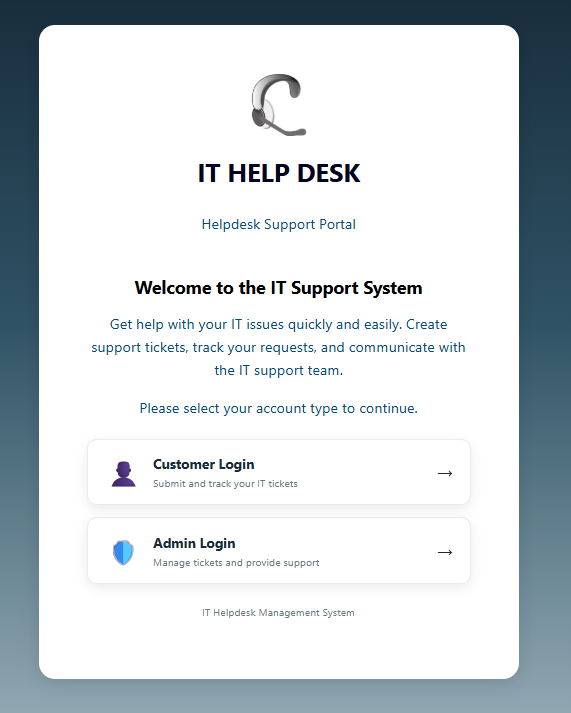
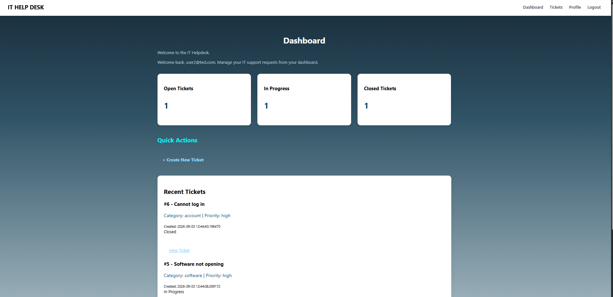
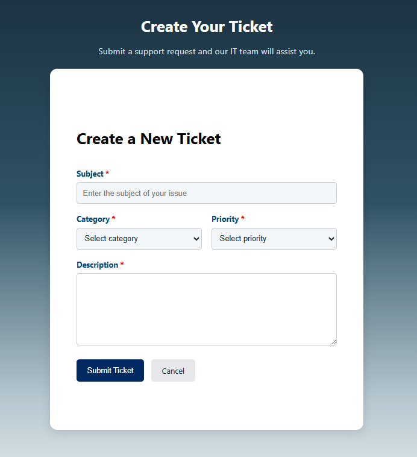
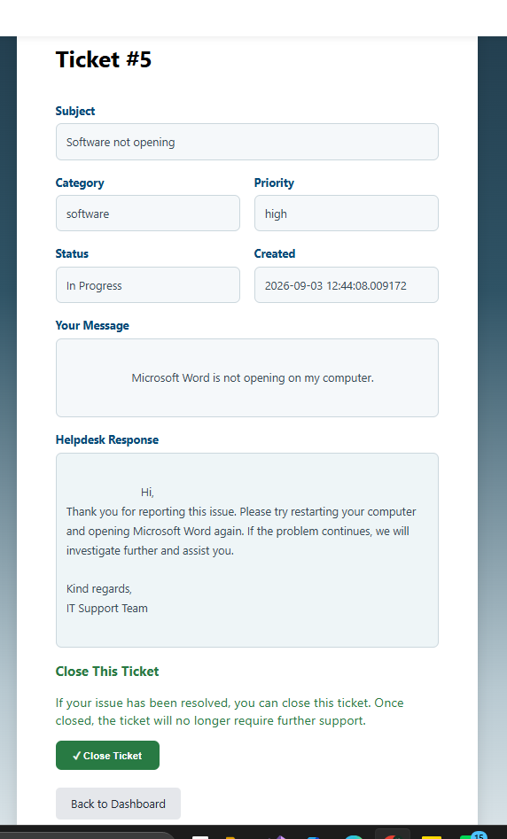
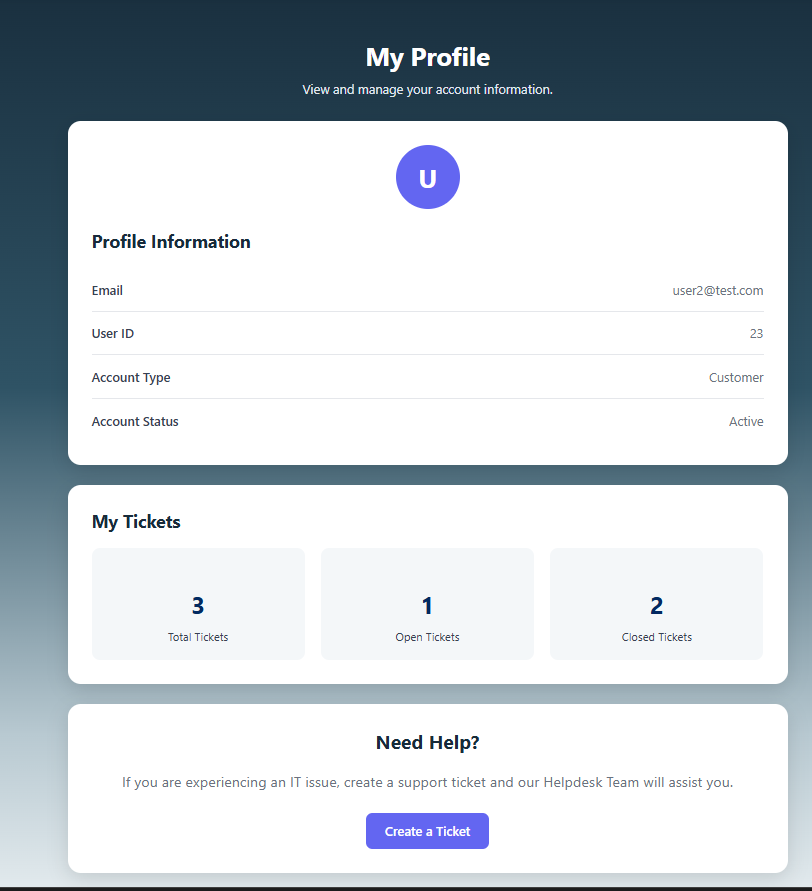
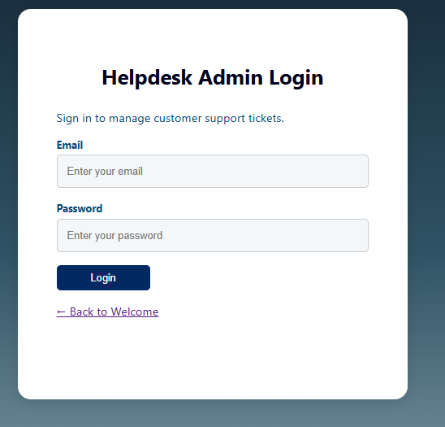
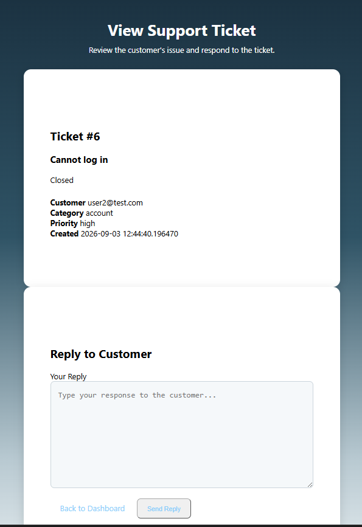

## IT Helpdesk Ticket Management System

A full-stack IT Helpdesk Ticket Management System developed using Python, FastAPI, PostgreSQL, HTML, CSS, and JavaScript.

The system provides separate functionality for Employees and Support Staff, allowing employees to submit and track IT support requests while support staff can manage, update, and respond to tickets.

## Users Types
The system supports two types of users:

Employee

Employees can:

Register and log in
View their dashboard
Create support tickets
View their own tickets
View ticket details
View support responses
Close their tickets
Track ticket status
Support Staff

Support staff can:

Log in through the Helpdesk portal
View all customer tickets
View individual ticket details
Respond to customer tickets
Update ticket status
Manage ticket priority
Assign tickets
Add resolution notes

## Current Features
User Registration

Email validation
Duplicate email checking
Password validation
Password confirmation
Secure password hashing
User account creation

Authentication & Sessions

Customer login
Support staff login
Session-based authentication
Separate customer and support staff sessions
Protected pages
Login error handling
Logout functionality
Unauthenticated users are redirected to the appropriate login page

Ticket Management

Create support tickets
Store tickets in PostgreSQL
View personal tickets
View all tickets as support staff
View individual ticket details
Add support responses
Update ticket status
Update ticket priority
Assign tickets
Add resolution information
Close tickets

## Ticket Status

Tickets can move through the following workflow:

Open > In Progress > Closed

## System Workflow

#### Employee Workflow
Employee registers for an account.
Employee logs in.
Employee accesses the dashboard.
Employee creates a support ticket.
The ticket is stored in PostgreSQL.
The dashboard displays the employee's tickets.
Employee can select a ticket to view its details.
Support staff can respond to the ticket.
Employee can view the response.
Employee can close the ticket when the issue is resolved.

#### Support Staff Workflow
Support staff logs in through the Helpdesk login.
Support staff accesses the Helpdesk dashboard.
All customer tickets are displayed.
Support staff can view individual ticket details.
Support staff can update the ticket status and priority.
Support staff can assign tickets.
Support staff can provide responses and resolution information.
The employee can view the updated ticket information.

## Technology Stack

Backend-

Python
FastAPI
PostgreSQL
Jinja2
Session Middleware

Frontend -

HTML5
CSS3
JavaScript
Jinja2 Templates

Development Tools -
Visual Studio Code
Git
GitHub
GitHub Copilot

Deployment -
Vercel

## installation
python -m venv venv
venv\Scripts\activate

main:
pip install fastapi uvicorn jinja2 python-multipart
pip install "pwdlib[argon2]"
pip install email-validator
pip install "psycopg[binary]"
pip install itsdangerous

## Run
python -m uvicorn app.main:app --reload

## Security & Validation

The system currently includes:

Server-side email validation
Duplicate account checking
Password strength requirements
Secure password hashing using Argon2
Password confirmation validation
Session-based authentication
Protected customer pages
Protected support staff pages
User-specific ticket access
Session-based user identification
Logout and session clearing

Login page 

## 🚧 Future Development

The following functionality may be added in future development:
AI-assisted ticket classification
AI-based priority suggestions
AI-generated response suggestions
AI-generated ticket summaries
Additional reporting and analytics
Further security and deployment improvements

