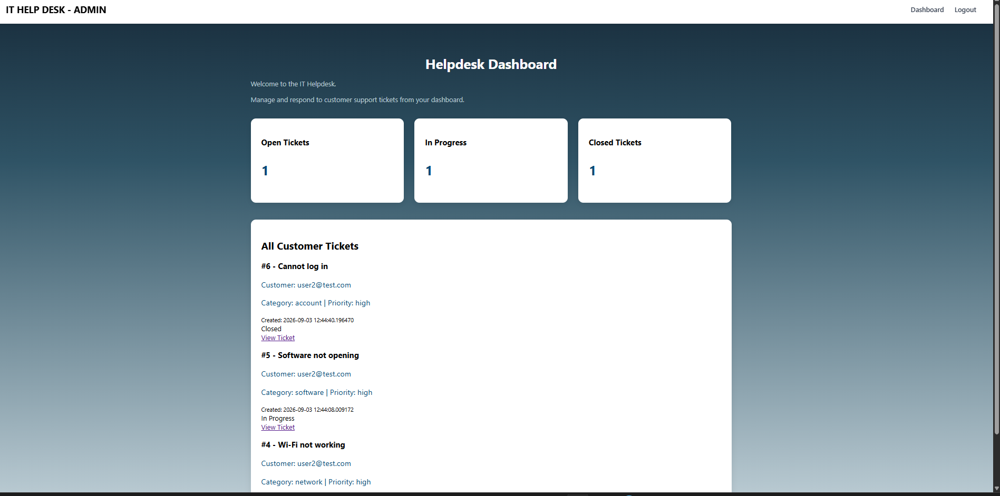
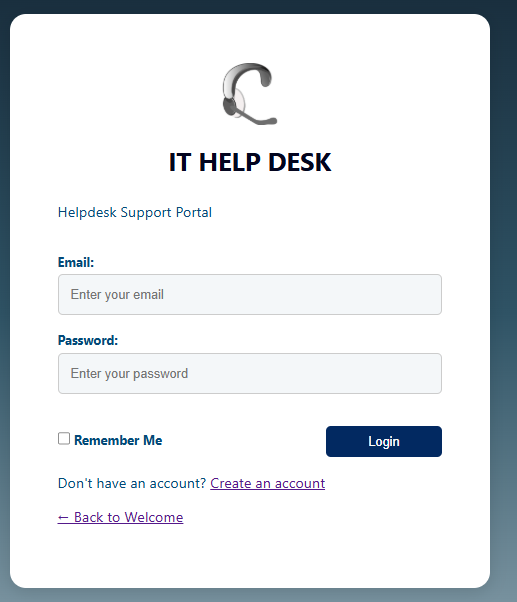

🚧 Currently under development.  

## AI-Powered IT Helpdesk System 

An AI-powered full-stack IT Helpdesk Ticketing System built with Python and FastAPI, featuring AI-assisted ticket classification, priority suggestions, and professional response generation.

Users (Two types)
Employee
Support Staff

Employee can:
Log in
View dashboard
Create support ticket
View own tickets
View ticket details
Add comments
Close their ticket
Receive AI-assisted ticket classification and priority suggestions

Support Staff can:
Log in
View all tickets
View ticket details
Change ticket status
Change priority
Assign tickets
Add resolution notes
Generate AI-assisted response suggestions 
Generate AI ticket summaries

## installation
python -m venv venv
venv\Scripts\activate

main:
pip install fastapi uvicorn jinja2 python-multipart
pip install "pwdlib[argon2]"
pip install email-validator
pip install "psycopg[binary]"

later:
pip install itsdangerous

## Run
python -m uvicorn app.main:app --reload

## Technology stack

Backend
    Python
    FastAPI
    PostgreSQL 
    Open AI API

Frontend
    HTML5
    React
    CSS3
    JavaScript
    Jinja2

Development
    VS Code
    Git
    GitHub
    GitHub Copilot
    Vercel

## features
Registration
Login
SQLite user table
Session middleware
user_id stored in session
Email stored in session
Protected dashboard
Logout
Login error message
Register link
User account checking
AI Ticket Classification 
AI Suggested Response

## Registration Validation
Email is required and validated.
backend email validation.
Duplicate emails are rejected.
Password must be 8+ characters.
Requires uppercase, lowercase, and number.
Password confirmation must match.
Passwords are securely hashed before storage.
Protected dashboard using authenticated session.
User ID and email are stored in the session after login.
Server uses the session to identify the logged-in user.
Users without a valid session are redirected to the login page.
Logout clears the session.

Login page 

Steps
Customer Account Login
Customer creates ticket
Ticket saved in PostgreSQL
Dashboard shows ticket count
Customer can click/view a ticket
Helpdesk can see all tickets
Helpdesk can reply
Customer can see the reply
Ticket status changes: Open → In Progress → Closed